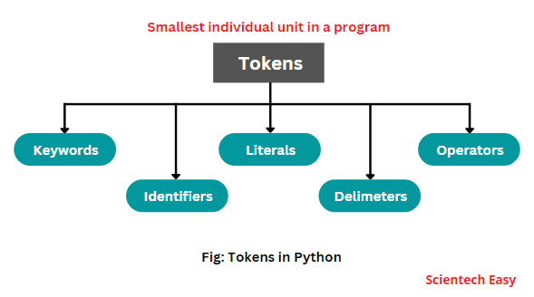
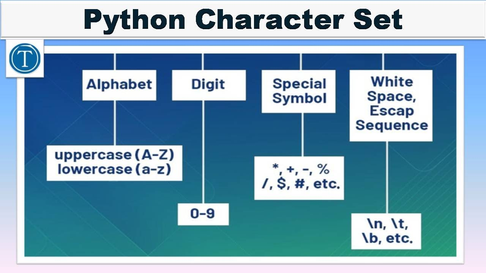

# 2. Python Fundamentals


<span style="display: flex; justify-content: space-between; width: 100%; align-items: center;">
    <a href="../01-module-01-getting-started/README.md">
        
    </a>
    <a href="../03-module-03-data-handling/README.md">
        
    </a>
</span>

# 2.1 Basic Syntax


## Indentation

- **Python**: 
  - Python uses indentation to indicate code blocks instead of curly braces.
  - **Scenario**: You have a block of code inside an `if` condition.
    ```python
    if x > 10:
        print("x is greater than 10")
    ```
  - **Python is strict about indentation**; inconsistent indentation will cause a `IndentationError`.

- **Other Languages (Java, C, JavaScript)**:
  - Java, C, and JavaScript use curly braces `{}` to denote code blocks. Indentation is still a convention, but not strictly enforced.
    ```java
    if (x > 10) {
        System.out.println("x is greater than 10");
    }
    ```
  - Missing braces or improper formatting doesn’t cause an error (just less readable code).

## No Semicolon, No Parentheses (for control statements)

- **Python**:
  - Python does not require semicolons at the end of statements.
  - **Scenario**: Writing a simple print statement.
    ```python
    print("Hello, world!")
    ```

- **Other Languages**:
  - **Java/C/JavaScript**: Require semicolons after each statement.
    ```java
    System.out.println("Hello, world!");  // Semicolon is required
    ```
  - **Control structures** (like `if`, `for`, etc.) in Python do not require parentheses.
    ```python
    if x > 10:
        print("x is greater than 10")
    ```

  - In **Java/C/JavaScript**, parentheses are required:
    ```java
    if (x > 10) {
        System.out.println("x is greater than 10");
    }
    ```


## Python Tokens


Tokens are the smallest individual units or elements in a Python program that the Python interpreter identifies. These tokens serve as the building blocks of the source code.

Python language supports various types of tokens, including:

- **Keywords (Reserved words)**: `True`, `False`, `None`, `class`, `continue`, `break`, `if`, `elif`, `else`, `from`, `or`, `def`, `del`, `import`, etc.
- **Identifiers**: User-defined names.
- **Literals**: String, Numeric, Boolean, Collection.
- **Delimiters**: `()`, `{}`, `[]`, `:`, `.`, `=`, `;`, `+=`, `-=`, `*=`, `/=`, `%=`, etc.
- **Operators**: `+`, `-`, `*`, `**`, `/`, `%`, `<<`, `>>`, etc.



Python interpreter scans written text in the program source code and converts it into tokens during the conversion of source code into machine code.

## How to Identify Tokens in a Python Program?

To identify the tokens in a Python program, let's consider an example.

### Python Program to Find the Subtraction of Two Numbers

```python
# Python program to find the subtraction of two numbers.
x = int(input("Enter your first number = "))
y = int(input("Enter your second number = "))
sub = x - y
print("Result = ", sub)
```

**Output:**
```
Enter your first number = 30
Enter your second number = 20
Result =  10
```

### Token Breakdown:

1. **First Statement:**
   The first statement consists of the following tokens:
   ```
   x = int(input("Enter your first number = "))
   ```
   - `x`
   - `=`
   - `int`
   - `(`
   - `input`
   - `(`
   - `"Enter your first number = "`
   - `)`
   - `)`

2. **Second Statement:**
   The second statement contains the following tokens:
   ```
   y = int(input("Enter your second number = "))
   ```
   - `y`
   - `=`
   - `int`
   - `(`
   - `input`
   - `(`
   - `"Enter your second number = "`
   - `)`
   - `)`

3. **Third Statement:**
   The third statement contains the following tokens:

   ```
   sub = x - y
   ```
   - `sub`
   - `=`
   - `x`
   - `-`
   - `y`

### Notes:
- The Python interpreter ignores the `#` comment symbol and the text that follows it.
- Tokens are used by the interpreter to detect errors, primarily syntax errors. If tokens are not arranged in the correct sequence, the interpreter will produce an error.


## Python Character Set



The character set in Python includes the following characters:

1. **Alphabet**: This includes both uppercase and lowercase English alphabet letters:
   - Uppercase: `{A, B, C, D, E, ...}`
   - Lowercase: `{a, b, c, d, e, f, ...}`

2. **Digits**: This includes the numeric digits:
   - `{0, 1, 2, ... 9}`

3. **White Spaces**: This includes spaces,  escape sequence such as line breaks (enters), and tabs.

4. **Special Characters**: This includes various special symbols, such as:
   - `{, !, ?, #, <, >, (, ), %, ", &, ^, *, <<, >>, [, ], +, =, /, -, _, :, ;, }`


##  Keywords, PEP8
## Python Reserved Keywords (3.12.0)

In Python, reserved keywords are special words that have predefined meanings and cannot be used as identifiers (like variable or function names).

To get a list of reserved keywords in Python 3.12.0, you can use the `keyword` module as follows:

### Code Example

```python
import keyword
print(keyword.kwlist)
```

```css
['False', 'None', 'True', 'and', 'as', 'assert', 'async', 'await', 'break', 'class', 'continue', 'def', 'del', 'elif', 'else', 'except', 'finally', 'for', 'from', 'global', 'if', 'import', 'in', 'is', 'lambda', 'nonlocal', 'not', 'or', 'pass', 'raise', 'return', 'try', 'while', 'with', 'yield']
```

These are the reserved keywords in Python 3.12.0. They cannot be used as variable or function names in your code.


## What is PEP?

**PEP** stands for **Python Enhancement Proposal**. Think of it like a suggestion or plan for improving Python. It's a way for people to propose new features, improvements, or changes to Python.

For example, if someone thinks a new feature would make Python better, they write a PEP to explain it. The Python community discusses the idea, and if everyone agrees, it becomes part of Python.

---

### What is PEP 8?

**PEP 8** is a set of **rules** for writing Python code that is **easy to read and consistent**. It's like a guidebook for how your code should look. Following PEP 8 makes your code more organized and easier for other programmers to understand.

If you've ever joined a group project, you know that it's easier to work together when everyone follows the same rules. PEP 8 does that for Python code.

---

### Key Points from PEP 8 (in simple terms)

#### 1. **Indentation (Spaces)**:
   - When you write code, use **4 spaces** (not tabs) to indent. This makes it clear which lines belong to certain blocks of code.
   - Example:
     ```python
     def greet():
         print("Hello!")
     ```
     The 4 spaces under `def greet():` show that `print("Hello!")` is part of the `greet` function.

#### 2. **Line Length**:
   - Try not to make any line of code longer than **79 characters**. This makes it easier to read, especially on smaller screens.
   - Example:
     ```python
     # A very long line of code that goes over 79 characters should be split into multiple lines for better readability.
     ```

#### 3. **Blank Lines**:
   - Use **blank lines** to separate different sections of your code to make it more readable.
   - Example:
     ```python
     def greet():
         print("Hello!")
         
     def farewell():
         print("Goodbye!")
     ```

#### 4. **Imports**:
   - If you're using extra libraries (like `math` or `random`), put all **imports** at the **top of the file**.
   - Example:
     ```python
     import math
     import random
     ```

#### 5. **Naming Conventions** (How to Name Things):
   - **Variables** and **functions** should be in **lowercase** with **underscores** between words.
     - Example: `my_variable`, `my_function()`
   - **Classes** should be in **CapitalizedWords** (no underscores).
     - Example: `MyClass`
   - **Constants** (things that don't change) should be **all uppercase** with underscores.
     - Example: `MAX_SPEED`

#### 6. **Whitespace (Spaces)**:
   - Don’t put unnecessary spaces in your code. It should be clean.
   - Example:
     ```python
     # Good:
     x = 5 + 3

     # Bad:
     x = 5+3
     ```

#### 7. **Docstrings (Explaining What Your Code Does)**:
   - If you're writing a function or class, explain what it does using **triple quotes** (`"""`).
   - Example:
     ```python
     def add(a, b):
         """
         Adds two numbers together and returns the result.
         
         Parameters:
         a: The first number.
         b: The second number.
         
         Returns:
         The sum of the two numbers.
         """
         return a + b
     ```

---

### Why Should You Follow PEP 8?

- **Makes Code Clear**: Following PEP 8 makes your code easy to read and understand. This is helpful for other programmers (and for you, when you look at your code later!).
- **Consistency**: It helps everyone write code in the same way, making it easier to work together.
- **Helps with Debugging**: Clean, organized code is easier to find and fix problems in.

### Example Summary

Here's a full example that follows PEP 8:

```python
import random

# Function to calculate the area of a circle
def circle_area(radius):
    """
    This function calculates the area of a circle.
    
    Parameters:
    radius (float): The radius of the circle
    
    Returns:
    float: The area of the circle
    """
    return 3.14 * radius ** 2

# Example usage of the function
radius = 5
print("The area of the circle is:", circle_area(radius))
```

In this example:
- We **import** libraries at the top.
- The function `circle_area()` has a **docstring** explaining what it does.
- We follow the **naming convention** for the function (`circle_area`) and variable (`radius`).

By following PEP 8, your code will be easier to read and understand!

---

# 2.2 Flow of the Python Program

- Depends on python flavor


- **Python**:
  - **Sequential Execution**: Statements are executed in the order they appear.
    ```python
    x = 5
    y = x + 3
    print(y)
    ```

  - **Control Flow**: Use of conditional statements, loops, functions, and exceptions to change execution.
    ```python
    if x > 10:
        print("x is greater than 10")
    else:
        print("x is 10 or less")
    ```

- **Other Languages**:
  - **Java/C/JavaScript**: Similar flow with the use of control flow statements (`if`, `while`, `for`), but often with a more verbose syntax for defining structures.
    ```java
    if (x > 10) {
        System.out.println("x is greater than 10");
    } else {
        System.out.println("x is 10 or less");
    }
    ```
  - **Java/C**: More explicit type declarations before using variables.

---

# 2.3 Working with Interactive Mode

## Evaluating expressions

- **Python**:
  - Python's interactive mode (REPL) evaluates expressions immediately and prints results.
    ```python
    >>> 5 + 3
    8
    >>> "Hello" + " World"
    'Hello World'
    ```

- **Optional in Python**:
  - You can use interactive mode for quick testing or debugging.
  - You can also assign variables and use expressions in the REPL.
    ```python
    >>> x = 5
    >>> y = x * 2
    >>> y
    10
    ```

- **Other Languages**:
  - **Java, C, JavaScript**: Do not have a native interactive mode like Python. You would need to write and compile the entire program.
    - **Java**: You need to write the whole class structure to execute the code.
    ```java
    public class Main {
        public static void main(String[] args) {
            System.out.println(5 + 3);  // Output 8
        }
    }
    ```
    - **C**: Similarly, you need to write a full program to test a simple expression.
    ```c
    #include <stdio.h>
    int main() {
        printf("%d", 5 + 3);  // Output 8
        return 0;
    }
    ```
    - **JavaScript**: You can use the browser’s console for quick evaluation.
    ```javascript
    console.log(5 + 3);  // Output 8
    ```

---


# 2.4 Working with Script Mode

## What is a Script?

- **Python**:
  - A script is a Python file containing statements that can be executed. Typically ends with `.py`.
    - **Scenario**: Writing a function in a script.
      ```python
      def greet(name):
          print(f"Hello, {name}!")
      greet("Alice")
      ```

- **Other Languages**:
  - **JavaScript**: A JavaScript script is often a `.js` file that can be executed in the browser or using Node.js.
    ```javascript
    function greet(name) {
        console.log(`Hello, ${name}!`);
    }
    greet("Alice");
    ```

  - **C/Java**: Requires an entry point like `main()` and generally needs to be compiled before execution.
    - **C**:
    ```c
    #include <stdio.h>
    int main() {
        printf("Hello, Alice!\n");
        return 0;
    }
    ```
    - **Java**:
    ```java
    public class Main {
        public static void main(String[] args) {
            System.out.println("Hello, Alice!");
        }
    }
    ```


## What is a Program?

- A program is a set of instructions for a computer, written in a programming language such as Python, Java, or C++. It tells the computer how to perform specific tasks and is composed of source code written by a programmer. 

- A program can be compiled, converting the code to machine code, or interpreted, where it is executed line-by-line. When executed, the computer follows these instructions to produce the desired output.


## Types of Script

Scripting languages are used to create scripts that automate tasks without requiring human interpretation. They are typically run through an interpreter rather than being compiled. Scripting languages can be divided into client-side (affecting what the user interacts with) and server-side (operating behind the scenes on the server).

**14 Top Scripting Languages**:
1. **JavaScript** - For interactive websites.
2. **PHP** - A general-purpose scripting language, mainly used in web development.
3. **Python** - Known for its simplicity, used in web development, AI, and more.
4. **Perl** - Used for text processing and web development.
5. **Ruby** - Ideal for web applications and data analysis.
6. **Bash** - A command-line scripting language for Unix systems.
7. **R** - Popular for statistics and data analysis.
8. **Lua** - Used in game development.
9. **Emacs Lisp** - For Unix systems and command line tasks.
10. **Groovy** - Similar to Java, used in web development.
11. **PowerShell** - Primarily for automating computer tasks.
12. **VBA** - Used to automate Microsoft applications like Excel.
13. **GML** - Scripting language for Game Maker Studio.
14. **VBScript** - A client-side and server-side language based on Visual Basic.

**Tips for Learning Scripting**:
- Align language learning with career goals.
- Use online courses and resources.
- Consider formal education in computer science.
- Practice coding regularly to improve skills.
- Search for solutions in online communities when stuck.


## Types of Programming Languages

1. **Procedural Languages**  
   - **Ada**, **C/C++**, **JavaScript**.

2. **Functional Languages**  
   - **Agda**, **PureScript**, **APL**.

3. **Object-oriented Languages**  
   - **Java**, **Python**, **Ruby**.

4. **Scripting Languages**  
   - **Perl**, **PHP**, **JavaScript**.

5. **Declarative Languages**  
    - **Prolog**, **Lisp**, **Haskell**.


---


# 2.5 Variables


## What are Variables?

Variables are used to store data values in Python.

## Creating Variables

In Python, there’s no need to explicitly declare a variable. It’s created when you assign a value to it.

### Example:
```python
age = 25
name = "Alice"
print(age)
print(name)
```

## Changing Variable Type

A variable in Python can change its type after it's been assigned a value. Python doesn’t require a fixed type for variables.

### Example:
```python
score = 10       # score is an integer
score = "High"   # score is now a string
print(score)
```

## Casting Variables

You can explicitly change the type of a variable using casting functions.

### Example:
```python
x = str(10)   # x becomes '10' (string)
y = int(10)   # y becomes 10 (integer)
z = float(10) # z becomes 10.0 (float)
```

## Checking Variable Type

To find out the type of a variable, use the `type()` function.

### Example:
```python
age = 25
name = "Alice"
print(type(age))
print(type(name))
```

## Single or Double Quotes?

You can define string variables using either single quotes or double quotes.

### Example:
```python
greeting = "Hello"
# is the same as
greeting = 'Hello'
```

## Case-Sensitivity

Variable names in Python are case-sensitive. This means that lowercase and uppercase letters are treated as different variables.

### Example:
```python
height = 150
Height = "Tall"
# 'Height' is a different variable from 'height'
```

## Assigning Multiple Values to Multiple Variables

Python allows you to assign values to multiple variables in one line.

### Example:
```python
color1, color2, color3 = "Red", "Green", "Blue"
print(color1)
print(color2)
print(color3)
```

> **Note:** Ensure the number of variables matches the number of values to avoid errors.

## Assigning One Value to Multiple Variables

You can also assign the same value to several variables in a single line.

### Example:
```python
color1 = color2 = color3 = "Yellow"
print(color1)
print(color2)
print(color3)
```


## Exercise

Which of these is the correct syntax to assign the value 'Goodbye' to three variables in one statement?

1. `a, b, c = 'Goodbye'`
2. `a = b = c = 'Goodbye'`
3. `a|b|c = 'Goodbye'`

---

## Identifiers

In Python, an **identifier** is a name given to various program elements such as classes, functions, modules, or variables.

### Rules for Defining Identifiers in Python:

1. **Allowed Characters**:
   - Identifiers can consist of alphabetic characters (both uppercase and lowercase).
   - Identifiers can include digits (0-9), but they cannot start with a digit.
   - The underscore symbol (`_`) is allowed.
   - Using other special characters like `$` will result in a syntax error.
     - **Valid**: `cash = 10`
     - **Invalid**: `ca$h = 10`

2. **Start of Identifier**:
   - An identifier cannot begin with a digit.
     - **Invalid**: `123total`
     - **Valid**: `total123`

3. **Case Sensitivity**:
   - Python is case-sensitive. This means `total`, `TOTAL`, and `Total` are considered distinct identifiers.
   
   ```python
   total = 10
   TOTAL = 999
   print(total)  # Output: 10
   print(TOTAL)  # Output: 999
   ```

4. **Reserved Words**:
   - Python has a set of reserved keywords that cannot be used as identifiers (e.g., `if`, `def`, `class`, etc.).
     - **Invalid**: `def = 10`
     - **Valid**: `my_def = 10`

5. **Length**:
   - There is no length limit for identifiers, but it is recommended not to use overly long names for clarity.

6. **Special Symbols**:
   - The dollar symbol (`$`) is not allowed in identifiers.

### Additional Notes on Identifiers:
- If an identifier starts with an underscore (`_`), it is often used to indicate that the identifier is intended to be "private."
- If an identifier starts with two underscores (`__`), it indicates a **strongly private** identifier.
- If an identifier begins and ends with two underscores (`__`), it is a **special** name or "magic method" defined by Python (e.g., `__add__`).

### Examples of Identifiers:
- **Valid Identifiers**:
  - `total123`
  - `java2python`
  - `_abc_abc`
  - `__init__`

- **Invalid Identifiers**:
  - `123total` (cannot start with a digit)
  - `ca$h` (invalid character `$`)
  - `def` (reserved keyword)
  - `if` (reserved keyword)

---

### Exercise:
Evaluate whether the following names are valid Python identifiers:
- `123total` 
- `total123` 
- `java2python` 
- `ca$h` 
- `_abc_abc` 
- `def` 
- `if` 

---

**Note**:
- An identifier starting with a single underscore (`_`) typically signals that it is private (although not strictly enforced in Python).
- Identifiers that start and end with two underscores (`__`) are **magic methods** (e.g., `__add__`).

---

# 2.6 Input and Output in Python

## The `input()` function
The `input()` function in Python allows the user to provide input through the console. The input is always returned as a string.

### Example:
```python
name = input("Enter your name: ")
print(f"Hello, {name}!")
```
In this example, the program prompts the user to input their name and then greets them with a message.


## Vulnerability in `input()` (Python 2.x)

In Python 2.x, the `input()` function evaluated the user's input as a Python expression. This posed a significant security risk because an attacker could input malicious code that would be executed by Python. This is no longer an issue in Python 3.x, as `input()` always returns a string.

### Example of the Vulnerability (Python 2.x):

Consider the following Python 2.x code:

```python
# Python 2.x
user_input = input("Enter a value: ")
print("You entered:", user_input)
```

If a user enters a simple integer like `5`, the code will work fine, returning the value `5` as expected:

```
Enter a value: 5
You entered: 5
```

However, if the user enters something more malicious, such as `__import__('os').system('rm -rf /')`, Python 2.x will treat the input as a Python expression and execute it:

```python
Enter a value: __import__('os').system('rm -rf /')
```

This would run the command `rm -rf /`, which in a real-world scenario could result in disastrous consequences, like deleting system files.

This vulnerability occurs because `input()` in Python 2.x evaluates the input as a Python expression. In the case above, the expression `__import__('os').system('rm -rf /')` is executed, and the `os.system()` function is invoked to run shell commands.

### Fix in Python 3.x

In Python 3.x, the `input()` function was modified to return the input as a string and no longer evaluate the input as a Python expression. This change eliminates the security risk.

In Python 3.x, the following code would simply treat the input as a string:

```python
# Python 3.x
user_input = input("Enter a value: ")
print("You entered:", user_input)
```

If the user enters `__import__('os').system('rm -rf /')`, the program will simply print the string:

```
Enter a value: __import__('os').system('rm -rf /')
You entered: __import__('os').system('rm -rf /')
```

This input is treated as a plain string, and no harmful code is executed.

---

This change made in Python 3.x greatly improves security and prevents malicious users from exploiting the `input()` function.

### Explanation:
- In Python 2.x, `input()` would execute anything that looked like a valid Python expression. This could be dangerous if the user input was not trusted like `SQL injection`.
- In Python 3.x, `input()` no longer evaluates the input as Python code, instead treating everything as a string, which is safer.

## The `print()` function
The `print()` function in Python outputs data to the console. You can customize the behavior of `print()` using several parameters.

### New Line
By default, `print()` adds a newline after the output, but you can change this behavior by using the `end` parameter.

### Example:
```python
print("Hello,", end=" ")
print("world!")
```
Output:
```
Hello, world!
```
In this example, the `end=" "` argument makes sure that the two print statements are printed on the same line.

### Parameters: `end`, `sep`
- `end`: Specifies what is printed at the end of the statement. The default is `"\n"`, which creates a new line.
- `sep`: Specifies the separator between multiple arguments passed to `print()`. The default is `" "`.

### Example:
```python
print("Apple", "Banana", "Cherry", sep=", ")
```
Output:
```
Apple, Banana, Cherry
```
In this example, the `sep` parameter customizes the separator between the printed items.

## `raw_input()` (Note: Python 2.x)
In Python 2.x, `raw_input()` was used to take input as a string, while `input()` evaluated the input as a Python expression. In Python 3.x, `raw_input()` is no longer available, and `input()` behaves like `raw_input()` from Python 2.x.

### Example (Python 2.x):
```python
# Python 2.x
user_input = raw_input("Enter a string: ")
```

In Python 3.x, `input()` performs the same function, so there is no need for `raw_input()`.

## Output Formatting
Python provides various ways to format the output when printing values. The most common methods are using f-strings, `format()`, and string concatenation.

### Example (f-strings):
```python
name = "John"
age = 30
print(f"Name: {name}, Age: {age}")
```
Output:
```
Name: John, Age: 30
```

### Example (`format()`):
```python
name = "John"
age = 30
print("Name: {}, Age: {}".format(name, age))
```
Output:
```
Name: John, Age: 30
```

### Example (String Concatenation):
```python
name = "John"
age = 30
print("Name: " + name + ", Age: " + str(age))
```
Output:
```
Name: John, Age: 30
```

---

# 2.7 Working with Python Functions

## The `type()` function
The `type()` function in Python is used to determine the type of an object.

### Example:
```python
x = 42
print(type(x))  # Output: <class 'int'>

y = "Hello, world!"
print(type(y))  # Output: <class 'str'>
```
In this example, `type()` is used to check the types of an integer and a string.

## The `id()` function
The `id()` function returns the unique identifier (memory address) of an object in Python.

### Example:
```python
x = 42
y = 42
print(id(x))  # Output: Some unique identifier
print(id(y))  # Output: Same unique identifier since both are pointing to the same object
```

In this example, both `x` and `y` have the same value, and therefore, their unique identifiers (memory addresses) are the same.

---

## `dir()` Function
The `dir()` function in Python is used to get a list of all the attributes and methods that are available for an object. It provides a simple way to inspect the properties and functions that can be accessed or used for any given object.

### Basic Usage of `dir()`
When called without arguments, `dir()` returns the list of names in the current scope (i.e., the variables, functions, and modules available).

#### Example 1: Using `dir()` on a String Object
You can use `dir()` to view the available methods and properties of a string.

```python
print(dir("Hello"))
```

Output:
```
['__class__', '__delattr__', '__doc__', '__eq__', '__format__', '__ge__', '__getattribute__', '__gt__', '__hash__', '__init__', '__iter__', '__le__', '__len__', '__lt__', '__mod__', '__mul__', '__ne__', '__new__', '__reduce__', '__reduce_ex__', '__repr__', '__setattr__', '__sizeof__', '__str__', 'capitalize', 'casefold', 'center', 'count', 'encode', 'expandtabs', 'find', 'format', 'format_map', 'index', 'isalnum', 'isalpha', 'isascii', 'isdecimal', 'isdigit', 'isidentifier', 'islower', 'isnumeric', 'isprintable', 'isspace', 'istitle', 'isupper', 'join', 'ljust', 'lower', 'lstrip', 'partition', 'replace', 'rfind', 'rindex', 'rjust', 'rpartition', 'rsplit', 'rstrip', 'split', 'splitlines', 'swapcase', 'title', 'upper', 'zfill']
```

This output lists all the special and regular methods associated with string objects, such as `lower()`, `split()`, `capitalize()`, and so on.

### Example 2: Using `dir()` on a List Object
You can also use `dir()` to inspect the available methods for a list.

```python
my_list = [1, 2, 3, 4]
print(dir(my_list))
```

Output:
```
['__add__', '__class__', '__contains__', '__delattr__', '__delitem__', '__doc__', '__eq__', '__format__', '__ge__', '__getattribute__', '__getitem__', '__gt__', '__iadd__', '__imul__', '__init__', '__iter__', '__le__', '__len__', '__lt__', '__mul__', '__ne__', '__new__', '__reduce__', '__reduce_ex__', '__repr__', '__reversed__', '__setattr__', '__setitem__', '__sizeof__', '__str__', 'append', 'clear', 'copy', 'count', 'extend', 'index', 'insert', 'pop', 'remove', 'reverse', 'sort']
```

This lists methods like `append()`, `remove()`, `sort()`, and other operations you can perform on lists.

`Note`: Don't get worried about the classes, we learn these all concepts in our later chapters this is just an example.

### Example 3: Using `dir()` on a Custom Class
If you define your own class, you can use `dir()` to see the special and regular methods that are available.

```python
class Person:
    def __init__(self, name, age):
        self.name = name
        self.age = age

    def greet(self):
        return f"Hello, my name is {self.name}!"

person = Person("Alice", 30)
print(dir(person))
```

Output:
```
['__class__', '__delattr__', '__dict__', '__doc__', '__eq__', '__format__', '__ge__', '__getattribute__', '__gt__', '__hash__', '__init__', '__le__', '__lt__', '__ne__', '__new__', '__reduce__', '__repr__', '__setattr__', '__sizeof__', '__str__', 'greet', 'name', 'age']
```

You can see `greet`, `name`, and `age` as part of the attributes and methods of the `Person` class.

---

## `help()` Function
The `help()` function is used to display documentation about an object, function, or module. It provides details about the usage, parameters, return values, and other important information.

### Example 1: Using `help()` on a Built-in Function
You can use `help()` to get documentation on built-in Python functions, such as `print()`.

```python
help(print)
```

Output:
```
Help on built-in function print in module builtins:

print(...)
    print([object, ...], sep=' ', end='\n', file=sys.stdout, flush=False)
    
    Prints the values to a stream, or to sys.stdout by default. Optional keyword arguments:
    
    sep --  string inserted between values, default a space
    end --  string appended after the last value, default a newline
    file --  a file-like object (stream); defaults to the current sys.stdout
    flush --  whether to forcibly flush the stream.
```

This provides a detailed explanation of the `print()` function, including its parameters like `sep`, `end`, `file`, and `flush`.

### Example 2: Using `help()` on a Class
You can use `help()` to learn more about any class, such as the built-in `str` class.

```python
help(str)
```

Output:
```
Help on class str in module builtins:

class str(object)
 |  str(object='') -> str
 |  
 |  Built-in class for strings.
 |  
 |  Methods defined here:
 |  
 |  __add__(self, value, /)
 |      Return self+value.
 |  
 |  __contains__(self, key, /)
 |      Return a boolean indicating whether a substring exists in the string.
 |  
 |  __eq__(self, value, /)
 |      Return self==value.
 |  
 |  ...
```

The output provides details on the `str` class, including the methods like `__add__()`, `__contains__()`, `__eq__()`, and others. 

### Example 3: Using `help()` on a Module
You can use `help()` to get information about a Python module. For example, let's check the `math` module.

```python
import math
help(math)
```

Output:
```
Help on module math:

NAME
    math - Mathematical functions

DESCRIPTION
    This module provides access to mathematical functions.

FUNCTIONS
    acos(x)
        Return the arc cosine of x in radians.
    acosh(x)
        Return the inverse hyperbolic cosine of x.
    ...
```

This shows a list of functions available in the `math` module, along with a brief description of each.

### Example 4: Using `help()` on a Custom Class
You can also use `help()` on a class that you define yourself.

```python
class Person:
    """A class representing a person."""

    def __init__(self, name, age):
        self.name = name
        self.age = age

    def greet(self):
        """Greets the person."""
        return f"Hello, my name is {self.name}!"

help(Person)
```

Output:
```
Help on class Person in module __main__:

class Person(builtins.object)
 |  A class representing a person.
 |  
 |  Methods defined here:
 |  
 |  __init__(self, name, age)
 |      Initialize the person's name and age.
 |  
 |  greet(self)
 |      Greets the person.
```

This shows the class-level documentation and the methods defined in the class (`__init__` and `greet`).

---


<span style="display: flex; justify-content: space-between; width: 100%; align-items: center;">
    <a href="../01-module-01-getting-started/README.md">
        
    </a>
    <a href="../03-module-03-data-handling/README.md">
        
    </a>
</span>