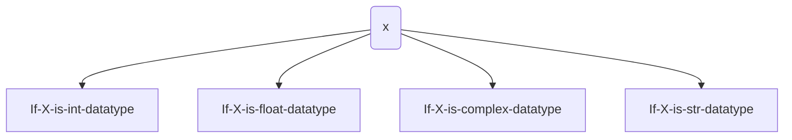

# Data Types in Python

## Table of Contents
1. [Introduction](#introduction)
2. [Inbuilt Data Types](#inbuilt-data-types)
3. [Python Inbuilt Functions](#python-inbuilt-functions)
4. [Int Data Type](#int-data-type)
   - [Decimal Form](#decimal-form-base-10)
   - [Binary Form](#binary-form-base-2)
   - [Octal Form](#octal-form-base-8)
   - [Hexadecimal Form](#hexadecimal-form-base-16)
5. [Base Conversions](#base-conversions)
6. [Float Data Type](#float-data-type)
7. [Complex Data Type](#complex-data-type)
8. [Bool Data Type](#bool-data-type)
9. [Str Type](#str-type)
10. [Slicing of Strings](#slicing-of-strings)
11. [Notes](#notes)

# Data Types in Python

Data types represent the type of data present inside a variable. In Python, we are not required to specify the type explicitly. Based on the value provided, the type will be assigned automatically. Hence, Python is a **dynamically typed language**.

## Inbuilt Data Types

Python contains the following inbuilt data types:

1. **int** - Integer type
2. **float** - Floating-point number type
3. **complex** - Complex number type
4. **bool** - Boolean type (True or False)
5. **str** - String type
6. **bytes** - Immutable byte sequence
7. **bytearray** - Mutable byte sequence
8. **range** - Represents a range of numbers
9. **list** - Ordered, mutable collection
10. **tuple** - Ordered, immutable collection
11. **set** - Unordered collection of unique elements
12. **frozenset** - Immutable version of a set
13. **dict** - Dictionary type (key-value pairs)
14. **None** - Represents the absence of a value

<p align="center"> </p>


### Python contains several inbuilt functions:

1. **`type()`**
   - To check the type of a variable.

2. **`id()`**
   - To get the address of an object.


3. **`print()`**
   - To print the value.

## Int Data Type
In Python, we can use the `int` data type to represent whole numbers (integral values).

**Example:**
```python
a = 10
type(a)  # Output: <class 'int'>
```

### Note:
- In Python 2, there is a `long` data type to represent very large integral values.
- In Python 3, there is no explicit `long` type; we can represent long values using the `int` type only.

### We can represent `int` values in the following ways:
1. **Decimal Form**
2. **Binary Form**
3. **Octal Form**
4. **Hexadecimal Form**

#### 1. Decimal Form (Base-10):
- It is the default number system in Python.
- The allowed digits are: `0 to 9`.

**Example:**
```python
a = 10
```
#### 2. Binary Form (Base-2):
- The allowed digits are: `0` & `1`.
- Literal values should be prefixed with `0b` or `0B`.

**Examples:**
```python
a = 0B1111  # Valid
# a = 0B123  # Invalid
# a = b111    # Invalid
```

#### 3. Octal Form (Base-8):
- The allowed digits are: `0 to 7`.
- Literal values should be prefixed with `0o` or `0O`.

**Examples:**
```python
a = 0o123  # Valid
# a = 0o786  # Invalid (8 is not allowed in octal)
```


#### 4. Hexadecimal Form (Base-16):
- The allowed digits are: `0 to 9`, `a-f` (both lower and upper cases are allowed).
- Literal values should be prefixed with `0x` or `0X`.

**Examples:**
```python
a = 0XFACE
b = 0XBeef
c = 0XBeer
```

Note: As a programmer, you can specify literal values in decimal, binary, octal, and hexadecimal forms. However, the Python Virtual Machine (PVM) will always provide values only in decimal form.

```python
a = 10        # Decimal
b = 0o10      # Octal
c = 0X10      # Hexadecimal
d = 0B10      # Binary

print(a)  # Output: 10
print(b)  # Output: 8
print(c)  # Output: 16
print(d)  # Output: 2
```

### Base Conversions

Python provides the following in-built functions for base conversions:

1. **`bin()`**:
   - We can use `bin()` to convert from any base to binary.
   
   **Examples:**

   ```python
   >>> bin(15)       # Output: '0b1111'
   >>> bin(0o11)     # Output: '0b1001'
   >>> bin(0X10)     # Output: '0b10000'
    ```


### Base Conversions

2. **`oct()`**:
   - We can use `oct()` to convert from any base to octal.
   
   **Examples:**
   ```python
   >>> oct(10)       # Output: '0o12'
   >>> oct(0B1111)   # Output: '0o17'
   >>> oct(0X123)    # Output: '0o443'
   ```


3. **`hex()`**
- We can use `hex()` to convert from any base to hexadecimal.

**Examples:**
```python
>>> hex(100)        # Output: '0x64'
>>> hex(0B111111)   # Output: '0x3f'
>>> hex(0o12345)    # Output: '0x14e5'
```

## float data type:

We can use float data type to represent floating point values (decimal values).  
Eg: `f = 1.234`  
`type(f)`  # Output: float  

We can also represent floating point values by using exponential form (scientific notation).  
Eg: `f = 1.2e3`  
`print(f)`  # Output: 1200.0  

Instead of 'e' we can use 'E'. The main advantage of exponential form is we can represent big values in less memory.  

***Note:***  
We can represent int values in decimal, binary, octal, and hexadecimal forms. But we can represent float values only by using decimal form.  

Eg:  
1) `f = 0B11.01`  
   File "<stdin>", line 1  
   `f = 0B11.01`  
   SyntaxError: invalid syntax  

2) `f = 0o123.456`  
   SyntaxError: invalid syntax  

3) `f = 0X123.456`  
   SyntaxError: invalid syntax  

## Complex Data Type:  
A complex number is of the form:

<p align="center"></p>

A complex number can contain integers or floating point values in its real and imaginary parts.  
Examples:  
- `3 + 5j`  
- `10 + 5.5j`  
- `0.5 + 0.1j`  

In the real part, we can specify values using decimal, octal, binary, or hexadecimal forms. However, the imaginary part should be specified only using decimal form.  

1) `>>> a = 0B11 + 5j`  
2) `>>> a`  
   Output: `(3 + 5j)`  
3) `>>> a = 3 + 0B11j`  
   SyntaxError: invalid syntax  

We can also perform operations on complex type values.  

1) `>>> a = 10 + 1.5j`  
2) `>>> b = 20 + 2.5j`  
3) `>>> c = a + b`  
4) `>>> print(c)`  
   Output: `(30 + 4j)`  
5) `>>> type(c)`  
   Output: `<class 'complex'>`

**Note:** The complex data type has some built-in attributes to retrieve the real and imaginary parts.  

Example:  
```python
c = 10.5 + 3.6j  
c.real  # Output: 10.5  
c.imag  # Output: 3.6  
```

## **4. Bool Data Type:**  
We can use this data type to represent boolean values. The only allowed values for this data type are:  
- **True** and **False**  

Internally, Python represents **True** as **1** and **False** as **0**.  
```python
b = True  
type(b)  # Output: <class 'bool'>  
```

```python
a = 10  
b = 20  
c = a < b  
print(c)  # Output: True
```

```python
True + True    # Output: 2  
True - False   # Output: 1  
```


**Str Type:**  
**str** represents the string data type. A string is a sequence of characters enclosed within single quotes or double quotes.

```python
s1 = 'sagar'  
s1 = "sagar"  
```

By using single quotes or double quotes, we cannot represent multi-line string literals. For this requirement, we should use triple single quotes `(''')` or triple double quotes `(""")`.

```python
s1 = '''sagar  
 soft'''  
s1 = """sagar  
 soft"""  
```

We can also use triple quotes to include single or double quotes in our string:


We can embed one string in another string:
```python
'''This "Python class very helpful" for java students'''  
```

**Slicing of Strings:**  
**Slice** means a piece. The `[ ]` operator is called the slice operator, which can be used to retrieve parts of a string. In Python, strings follow zero-based indexing.

- The index can be either positive or negative.
  - **Positive index** means forward direction from left to right.
  - **Negative index** means backward direction from right to left.


|-ve index| -5| -4| -3| -2| -1|   
|---|---|---|---|---|---|
|| S | a | g | a | r |
|+ve index| 0 | 1 | 2 | 3 | 4 |


```python
>>> s = "sagar" 
>>> s[0] 
's' 
>>> s[1] 
'a' 
>>> s[-1] 
'r' 
>>> s[40] 
IndexError: string index out of range

>>> s[1:40] 
'agar' 
>>> s[1:] 
'agar' 
>>> s[:4] 
'saga' 
>>> s[:] 
'sagar' 
>>> s * 3 
'sagarsagarsagar' 
>>> len(s) 
5 

```


## Note:

1. In Python, the following data types are considered as Fundamental Data types:
   - int 
   - float
   - complex
   - bool
   - str 

2. In Python, we can represent char values also by using str type; explicitly, char type is not available.  
   ```python
   >>> c = 'a'  
   >>> type(c)  
   <class 'str'>
    ```

3. The long data type is available in Python 2 but not in Python 3. In Python 3, long values can also be represented using the int type only.

4. In Python, we can represent char values using str type; explicitly, char type is not available.


<!-- update table of content from here-->
# Type Casting in Python

We can convert one type of value to another type. This conversion is called **Typecasting** or **Type Coercion**. The following are various inbuilt functions for type casting:

1. **`int()`**
2. **`float()`**
3. **`complex()`**
4. **`bool()`**
5. **`str()`**

## 1. `int()`
We can use this function to convert values from other types to `int`.

**Examples:**
```python
>>> int(123.987) 
123

>>> int(10 + 5j) 
TypeError: can't convert complex to int 

>>> int(True) 
1 

>>> int(False) 
0 

>>> int("10") 
10 

>>> int("10.5") 
ValueError: invalid literal for int() with base 10: '10.5' 

>>> int("ten") 
ValueError: invalid literal for int() with base 10: 'ten' 

>>> int("0B1111") 
ValueError: invalid literal for int() with base 10: '0B1111' 
```


## Note:
1. We can convert from any type to `int` except for the complex type.
2. If we want to convert `str` type to `int` type, the string must contain only integral values and should be specified in base-10.


## 2. float():
We can use the `float()` function to convert other type values to float type.

1) `>>> float(10)`  
   Output: `10.0`  

2) `>>> float(10+5j)`  
   Output: `TypeError: can't convert complex to float`  

3) `>>> float(True)`  
   Output: `1.0`  

4) `>>> float(False)`  
   Output: `0.0`  

5) `>>> float("10")`  
   Output: `10.0`  

6) `>>> float("10.5")`  
   Output: `10.5`  

7) `>>> float("ten")`  
   Output: `ValueError: could not convert string to float: 'ten'`  

8) `>>> float("0B1111")`  
   Output: `ValueError: could not convert string to float: '0B1111'`  

## Note:
1. We can convert any type value to float type except for complex type.
2. Whenever we are trying to convert `str` type to `float` type, the string must be either an integral or floating point literal and should be specified only in base-10.

## 3. complex():
We can use the `complex()` function to convert other types to complex type.

### Form-1: `complex(x)`
We can use this function to convert `x` into a complex number with real part `x` and imaginary part `0`.

1) `complex(10)`  
   Output: `10+0j`  

2) `complex(10.5)`  
   Output: `10.5+0j`  

3) `complex(True)`  
   Output: `1+0j`  

4) `complex(False)`  
   Output: `0j`  

5) `complex("10")`  
   Output: `10+0j`  

6) `complex("10.5")`  
   Output: `10.5+0j`  

7) `complex("ten")`  
   Output: `ValueError: complex() arg is a malformed string`  

### Form-2: `complex(x, y)`
We can use this method to convert `x` and `y` into a complex number such that `x` will be the real part and `y` will be the imaginary part.

1) `complex(10, -2)`  
   Output: `10-2j`  

2) `complex(True, False)`  
   Output: `1+0j`  


### 4. `bool()`
We can use this function to convert other type values to `bool` type.

1) `bool(0)`  
   Output: `False`  

2) `bool(1)`  
   Output: `True`  

3) `bool(10)`  
   Output: `True`  

4) `bool(10.5)`  
   Output: `True`  

5) `bool(0.178)`  
   Output: `True`  

6) `bool(0.0)`  
   Output: `False`  

7) `bool(10-2j)`  
   Output: `True`  

8) `bool(0+1.5j)`  
   Output: `True`  

9) `bool(0+0j)`  
   Output: `False`  

10) `bool("True")`  
    Output: `True`  

11) `bool("False")`  
    Output: `True`  

12) `bool("")`  
    Output: `False`  


```python

bool(X)
|
|-- If X is int datatype
|   |-- 0 means False
|   |-- Non-zero means True
|
|-- If X is float datatype
|   1. If total number value is zero, then the result is False
|   2. Otherwise, the result is True
|
|-- If X is complex datatype
|   1. If both real and imaginary parts are zero (i.e., 0+0j), then the result is False
|   2. Otherwise, the result is True
|
|-- If X is str datatype
    1. If X is an empty string, then the result is False
    2. Otherwise, the result is True
```


Tip: [How to create mermaid graphs, flowcharts, pie charts, class diagrams](https://github.com/mermaid-js/mermaid)



### 5. str()
We can use this method to convert other type values to `str` type.

**Examples:**
```python
>>> str(10) 
'10' 
>>> str(10.5) 
'10.5' 
>>> str(10 + 5j) 
'(10+5j)' 
>>> str(True) 
'True'
```


